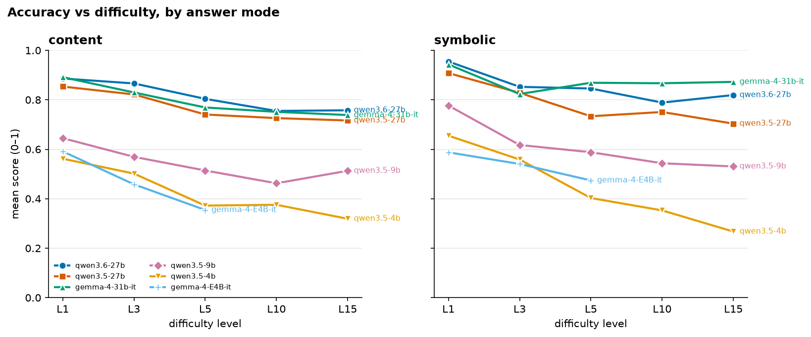
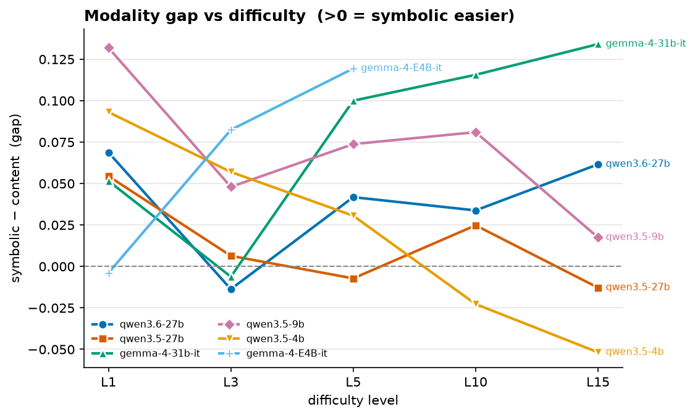
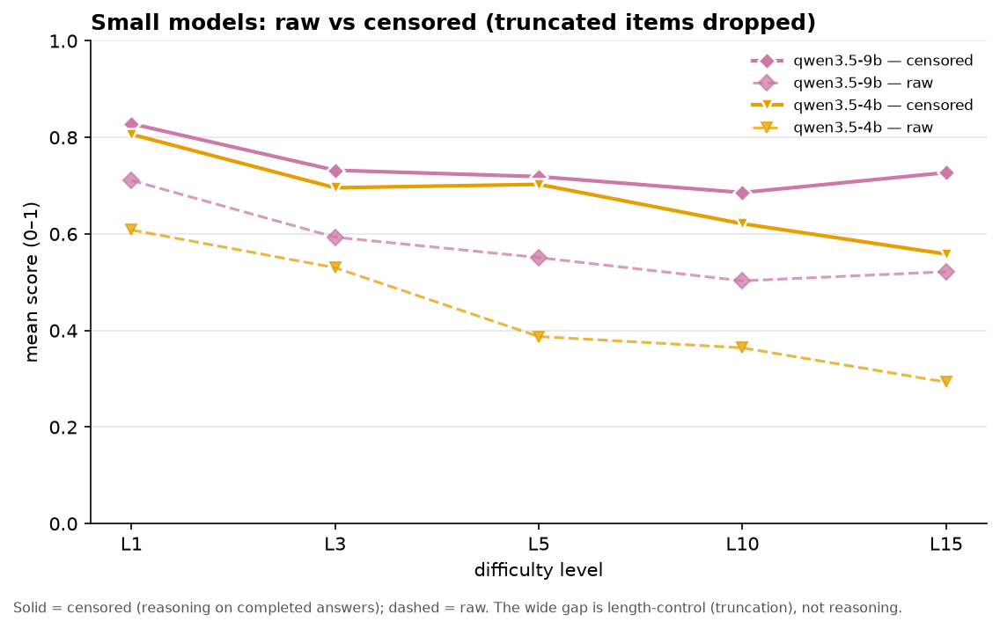
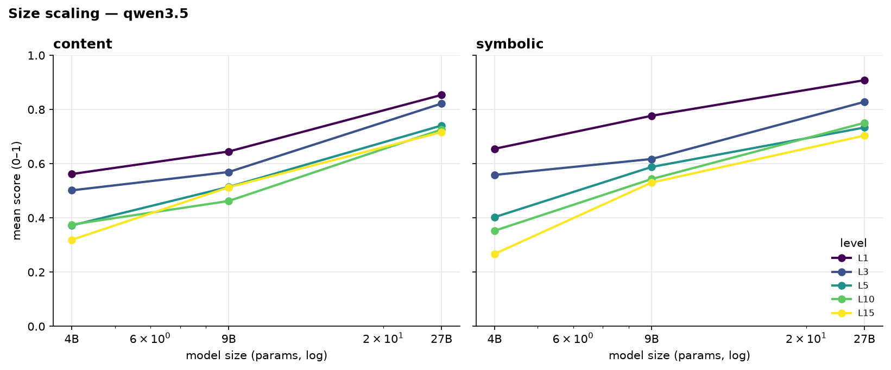
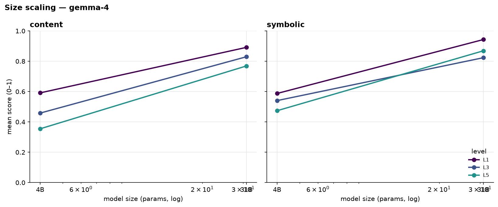
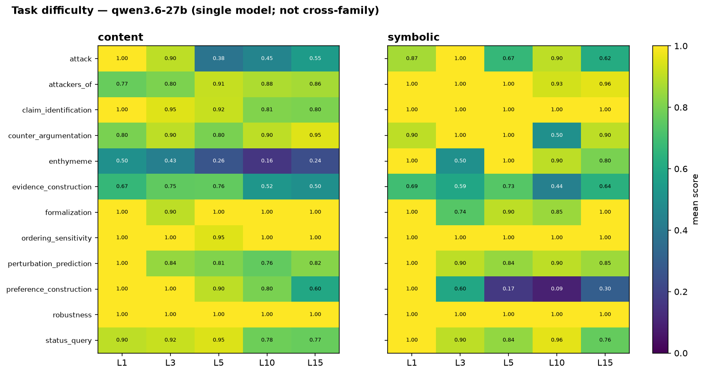

# ArgGYM frontier-model evaluation — 2026-07-24

Evaluation of instruction-tuned models on the ArgGYM defeasible-reasoning
benchmark across five difficulty levels, in both answer modes.

- **Taskset:** `pilot-20260723T131917Z-b19e635a` (1200 items; KB `0994f44e`)
- **Grid:** 12 tasks × 2 modes × 5 levels {1, 3, 5, 10, 15} × 10 samples
- **Models:** qwen3.6-27b, qwen3.5-27b, qwen3.5-9b, qwen3.5-4b, gemma-4-31b-it,
  gemma-4-E4B-it (llama-3.1-8b-instruct was rostered but is gated/uncached, skipped)
- **Elicitation:** none (thinking on where supported); greedy decode per each
  model's own `generation_config`.
- Each `(model, level)` pair is a **standalone** 240-item run and score, so per-level
  performance is directly comparable.

Gold is computed symbolically by the ASPIC+ engine (PyArg) under grounded semantics —
**never by an LLM.** Every item passes a build-time self-check (its own gold scores
1.0), so a low model score is a reasoning miss, not a grader artifact.

> **Reporting principle — content and symbolic are never combined.** The two modes
> present the same tasks through different input representations (natural-language
> statements vs. DSL atoms); they are not commensurable, so we never average them
> into one "overall" number. Results are reported per mode, plus their *gap* (a
> signed difference, which — unlike an average — is meaningful).

Figures are regenerated by `make_figures.py` in this folder.

---

## 1. Findings

1. **Ranking flips with difficulty.** At L1 the top models are near-tied; as
   difficulty rises **gemma-4-31b-it becomes the strongest**, because its scores
   decay far less than the others'.
2. **gemma's edge is specifically symbolic** — its symbolic score is essentially
   *flat* (~0.87) from L5 on (best at every hard level); its content score decays
   normally. The Qwens decay in both modes.
3. **The modality gap is model-specific.** The 27B Qwens are ~mode-agnostic (gap
   ≈ 0). gemma's gap *grows* with difficulty (symbolic becomes much easier) — a
   property of the model, not the task.
4. **Clean size scaling** within each family (Qwen 3.5: 4B<9B<27B; Gemma: E4B<31B)
   in both modes, with the size advantage widening at harder levels.
5. **Small models are length-limited, not reasoning-limited.** Their raw scores
   collapse mostly because generations run into the token cap; on completed
   answers (censored) their reasoning is far more robust and much flatter across
   difficulty. This is the report's most important caveat (§5).

---

## 2. How to read the levels

Levels are ordinal, not linear. **L1–L5 walk a feature ladder** (conflict/negation
unlock by L2, axioms/side-branches by L3, strict rules/chains by L4, undercuts by
L5); **L10 and L15 add only scale** (more atoms/rules, no new phenomena). So an
L1→L5 drop reflects *new kinds of reasoning*, while L5→L15 reflects *size* alone —
and scores largely plateau there for the strong models.

---

## 3. Accuracy vs difficulty, by mode

**Content** (mean score)
| model | L1 | L3 | L5 | L10 | L15 |
|---|---|---|---|---|---|
| qwen3.6-27b | 0.886 | 0.866 | 0.804 | 0.755 | 0.758 |
| gemma-4-31b-it | 0.891 | 0.830 | 0.769 | 0.751 | 0.738 |
| qwen3.5-27b | 0.854 | 0.822 | 0.741 | 0.726 | 0.716 |
| qwen3.5-9b | 0.645 | 0.569 | 0.514 | 0.462 | 0.513 |
| qwen3.5-4b | 0.562 | 0.502 | 0.372 | 0.376 | 0.319 |

**Symbolic** (mean score)
| model | L1 | L3 | L5 | L10 | L15 |
|---|---|---|---|---|---|
| qwen3.6-27b | 0.955 | 0.852 | 0.846 | 0.789 | 0.819 |
| gemma-4-31b-it | 0.943 | 0.823 | **0.869** | **0.867** | **0.872** |
| qwen3.5-27b | 0.908 | 0.828 | 0.733 | 0.751 | 0.704 |
| qwen3.5-9b | 0.777 | 0.617 | 0.588 | 0.543 | 0.530 |
| qwen3.5-4b | 0.655 | 0.559 | 0.403 | 0.353 | 0.267 |

**Reading:** In **content** the three ≥27B models cluster (qwen3.6 and gemma tied for
the lead, qwen3.5-27b just behind), decaying then flattening. In **symbolic** they
separate: **gemma is remarkably flat** (~0.87) after an L1→L3 dip and is top at L5,
L10, L15, while qwen3.5-27b decays most. This flatness drives the ranking flip.

---

## 4. Modality gap (symbolic − content)

How much the input representation matters, per model and difficulty. Positive =
symbolic easier. (The signed gap is meaningful; the average of the two modes is not.)

| model | L1 | L3 | L5 | L10 | L15 |
|---|---|---|---|---|---|
| qwen3.6-27b | +0.069 | −0.014 | +0.042 | +0.034 | +0.062 |
| qwen3.5-27b | +0.054 | +0.006 | −0.007 | +0.025 | −0.013 |
| gemma-4-31b-it | +0.052 | −0.006 | +0.100 | +0.116 | +0.134 |
| qwen3.5-9b | +0.132 | +0.048 | +0.074 | +0.081 | +0.017 |
| qwen3.5-4b | +0.093 | +0.057 | +0.031 | −0.023 | −0.052 |

**Reading:** All models start symbolic-favored at L1, then the gap collapses to ≈0
at L3 (the L3 feature unlocks tax symbolic reasoning too). After L3, **gemma
diverges** — its gap grows to +0.13 (symbolic far easier), its defining signature —
while the **27B Qwens stay near zero** (mode-agnostic). qwen3.5-4b's negative gap at
L10/L15 is a truncation artifact (its symbolic runs hit the cap hardest; see §5),
not genuine content strength.

---

## 5. Small models: raw vs. censored — length control, not reasoning

Truncation (an item's generation hitting the token cap, scoring 0 regardless of
ability) is a length-behavior diagnostic, not a reasoning score — and it dominates
the small models. The censored score drops truncated items, isolating reasoning on
completed answers.

| model · level | L1 | L3 | L5 | L10 | L15 |
|---|---|---|---|---|---|
| **9B** raw | 0.71 | 0.59 | 0.55 | 0.50 | 0.52 |
| **9B** censored | **0.83** | **0.73** | **0.72** | **0.69** | **0.73** |
| 9B truncated | 15% | 19% | 23% | 27% | 30% |
| **4B** raw | 0.61 | 0.53 | 0.39 | 0.36 | 0.29 |
| **4B** censored | **0.81** | **0.70** | **0.70** | **0.62** | **0.56** |
| 4B truncated | 28% | 25% | 47% | 46% | 49% |

For the ≥27B models truncation is ≤5% and raw ≈ censored, so this correction does not
apply to them (gemma never truncates).

**Reading:** The raw small-model "collapse" is largely a mirage. **Censored, the 9B
holds ~0.69–0.83 and the 4B ~0.56–0.81 — far flatter and higher than raw** — because
15–49% of their items never produce a scorable answer (degenerate looping into the
cap), not because they reason that much worse. Any capability read on the small
models must use censored alongside raw.

---

## 6. Size scaling

Score vs. model size at fixed generation, per level, per mode. Reading upward along
a curve shows the size effect; the vertical spread between level-curves shows how
much each size loses to difficulty.

*(The Gemma ladder — gemma-4-E4B-it vs gemma-4-31b-it — is being completed; higher-level
E4B points land as its addendum run finishes and this figure is regenerated.)*

**Reading:** Size ordering is monotone at every level in both modes (Qwen 3.5:
4B<9B<27B; Gemma: E4B<31B), and the level-curves fan out with size — **larger models
lose less to difficulty.** (Small-model points here are *raw*; per §5 their true
reasoning gap to the large models is smaller than these curves suggest.)

---

## 7. Task-difficulty profile (single reference model)

Per-task × level for one model (qwen3.6-27b) — apples-to-apples, no cross-family
averaging.

**Reading:** Retrieval/classification tasks (`status_query`, `claim_identification`,
`ordering_sensitivity`, `perturbation_prediction`) stay near-perfect across levels.
The **construct tasks** (`counter_argumentation`, `evidence_construction`,
`enthymeme`) are the hardest and degrade most — they require *building* a
well-formed, semantically-correct argument, not just classifying one — and are
harder in content than symbolic.

---

## 8. Caveats and threats to validity

- **The content-vs-symbolic gap is confounded.** Content and symbolic items are
  *independent instances*, not two renderings of one problem (different seeds;
  symbolic uses abstract atoms, content is drawn from real KB arguments). So the gap
  mixes representation, different logical instances, and world-knowledge priors. Read
  it as a descriptive model property here, not a clean representation measurement. A
  follow-up benchmark pairing one fixed structure with several coherent content
  renderings is planned to de-confound it (repo issue #15).
- **Small-model comparisons require censored scores** (§5).
- **Pure-scale levels carry little extra signal** — the informative difficulty is the
  qualitative feature ladder (L1–L5).
- **Roster gap:** llama-3.1-8b is gated/uncached and skipped; no external-family
  small model is included.
- **Point estimates:** single decode per item, 10 samples/cell (stderr ≈ 0.01–0.03).

---

## 9. Reproducibility

- Scores recompute offline from stored generations via the ASPIC+ engine — no GPU.
- Taskset `pilot-20260723T131917Z-b19e635a` is frozen and self-checking (all 1200
  gold answers score 1.0 at build); per-run provenance (model/sampling/elicitation/
  hashes/git SHA) is in each run's `run.json`.
- Figures: `make_figures.py` in this folder, from the `grid-full` sweep runs.
