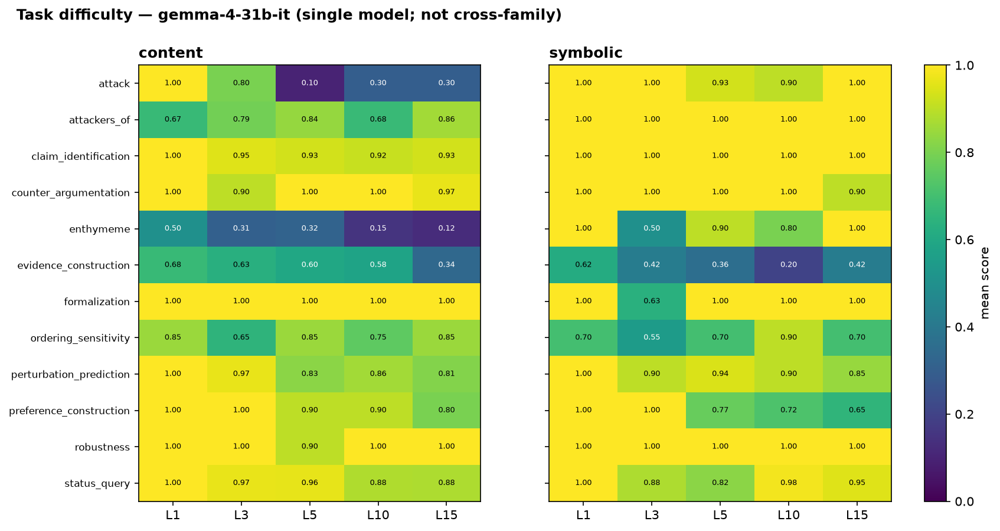

# ArgGYM frontier-model evaluation — 2026-07-24

Evaluation of instruction-tuned models on the ArgGYM defeasible-reasoning
benchmark across five difficulty levels, in both answer modes.

- **Taskset:** `pilot-20260723T131917Z-b19e635a` (1200 items; KB `0994f44e`)
- **Grid:** 12 tasks × 2 modes × 5 levels {1, 3, 5, 10, 15} × 10 samples
- **Models:** qwen3.6-27b, qwen3.5-27b, qwen3.5-9b, qwen3.5-4b, gemma-4-31b-it,
  gemma-4-E4B-it, llama-3.1-8b-instruct (served from the ungated
  `NousResearch/Meta-Llama-3.1-8B-Instruct` mirror of the identical weights)
- **Elicitation:** none (thinking on where supported); greedy decode per each
  model's own `generation_config`.
- Each `(model, level)` pair is a **standalone** 240-item run and score, so per-level
  performance is directly comparable. 33 of the 35 cells are present (7920 scored
  items); qwen3.6-27b at L3 and L5 is missing because those runs' stored generations
  were lost, and every number here is recomputed from stored generations, so those
  two cells are reported as `—` rather than carried over.

Gold is computed symbolically by the ASPIC+ engine (PyArg) under grounded semantics —
**never by an LLM.** Every item passes a build-time self-check (its own gold scores
1.0), so a low score is never the gold being wrong. It can still be something other
than a reasoning miss: an answer that never reaches the scorer in a readable form
scores 0 too, and for two models that is most of what the score measures (§5).

> **Reporting principle — content and symbolic are never combined.** The two modes
> present the same tasks through different input representations (natural-language
> statements vs. DSL atoms); they are not commensurable, so we never average them
> into one "overall" number. Results are reported per mode, plus their *gap* (a
> signed difference, which — unlike an average — is meaningful).

Figures are regenerated by `make_figures.py` in this folder.

---

## 1. Findings

1. **The symbolic ranking flips with difficulty.** qwen3.6-27b leads at L1 (0.955);
   from L5 on **gemma-4-31b-it is the strongest** (0.869 / 0.867 / 0.872), because
   its score stops decaying while the others' keep falling. In content the three
   ≥27B models stay a cluster — the L10/L15 ordering moves by less than the ~0.01–0.03
   standard error, so there is no reliable content flip.
2. **gemma's edge is specifically symbolic** — its symbolic score is essentially
   *flat* (~0.87) from L5 on; its content score decays normally (0.891 → 0.738).
   The Qwens decay in both modes.
3. **The modality gap is model-specific, and narrower than it looks.** qwen3.5-27b
   is mode-agnostic (gap ≈ 0 at every level past L1) while gemma-4-31b-it's gap
   *grows* with difficulty (+0.100 → +0.134). But per-task (§7) that whole gap is
   two tasks — `attack` and `enthymeme` — not a uniform representation effect.
4. **Clean size scaling** within each family (Qwen 3.5: 4B<9B<27B; Gemma: E4B<31B),
   monotone at every level in both modes, with the size advantage widening at
   harder levels.
5. **Most of the small-model collapse is not reasoning.** Two distinct
   non-reasoning failures dominate the bottom of the roster: the small Qwens run
   into the token cap (truncation 15–49%), and gemma-4-E4B-it and llama-3.1-8b
   fail to emit the answer contract at all (no `[answer]` region on 20–36% of
   items) while barely truncating. Neither is a defeasible-reasoning measurement.
   This is the report's most important caveat (§5).

---

## 2. How to read the levels

Levels are ordinal, not linear. **L1–L5 walk a feature ladder** (conflict/negation
unlock by L2, axioms/side-branches by L3, strict rules/chains by L4, undercuts by
L5); **L10 and L15 add only scale** (more atoms/rules, no new phenomena). So an
L1→L5 drop reflects *new kinds of reasoning*, while L5→L15 reflects *size* alone —
and scores largely plateau there for the strong models.

---

## 3. Accuracy vs difficulty, by mode

**Content** (mean score; bold = best at that level)
| model | L1 | L3 | L5 | L10 | L15 |
|---|---|---|---|---|---|
| qwen3.6-27b | 0.886 | — | — | **0.755** | **0.758** |
| gemma-4-31b-it | **0.891** | **0.830** | **0.769** | 0.751 | 0.738 |
| qwen3.5-27b | 0.848 | 0.822 | 0.741 | 0.726 | 0.716 |
| qwen3.5-9b | 0.645 | 0.569 | 0.514 | 0.462 | 0.505 |
| qwen3.5-4b | 0.545 | 0.502 | 0.358 | 0.367 | 0.341 |
| gemma-4-E4B-it | 0.591 | 0.458 | 0.354 | 0.388 | 0.375 |
| llama-3.1-8b-instruct | 0.133 | 0.141 | 0.122 | 0.105 | 0.088 |

**Symbolic** (mean score; bold = best at that level)
| model | L1 | L3 | L5 | L10 | L15 |
|---|---|---|---|---|---|
| qwen3.6-27b | **0.955** | — | — | 0.789 | 0.819 |
| gemma-4-31b-it | 0.943 | 0.823 | **0.869** | **0.867** | **0.872** |
| qwen3.5-27b | 0.908 | **0.828** | 0.733 | 0.751 | 0.704 |
| qwen3.5-9b | 0.778 | 0.617 | 0.593 | 0.556 | 0.530 |
| qwen3.5-4b | 0.654 | 0.559 | 0.403 | 0.345 | 0.267 |
| gemma-4-E4B-it | 0.588 | 0.540 | 0.474 | 0.404 | 0.504 |
| llama-3.1-8b-instruct | 0.286 | 0.204 | 0.120 | 0.107 | 0.097 |

**Reading:** In **content** the three ≥27B models cluster within ~0.04 of each other
at every level, decaying then flattening; the L10/L15 lead changes hands by less than
the standard error, so the content ordering at the top should not be read as a
ranking. In **symbolic** they separate: **gemma is remarkably flat** (~0.87) after an
L1→L3 dip and is top at L5, L10 and L15, while qwen3.5-27b decays most. That flatness
is what drives the ranking flip.

---

## 4. Modality gap (symbolic − content)

How much the input representation matters, per model and difficulty. Positive =
symbolic easier. (The signed gap is meaningful; the average of the two modes is not.)

| model | L1 | L3 | L5 | L10 | L15 |
|---|---|---|---|---|---|
| qwen3.6-27b | +0.069 | — | — | +0.034 | +0.062 |
| gemma-4-31b-it | +0.052 | −0.006 | +0.100 | +0.116 | +0.134 |
| qwen3.5-27b | +0.060 | +0.006 | −0.007 | +0.025 | −0.013 |
| qwen3.5-9b | +0.134 | +0.048 | +0.079 | +0.093 | +0.026 |
| qwen3.5-4b | +0.109 | +0.057 | +0.045 | −0.022 | −0.074 |
| gemma-4-E4B-it | −0.004 | +0.082 | +0.119 | +0.015 | +0.128 |
| llama-3.1-8b-instruct | +0.153 | +0.063 | −0.001 | +0.002 | +0.008 |

**Reading:** Most models start symbolic-favored at L1, then the gap collapses to ≈0
at L3 (the L3 feature unlocks tax symbolic reasoning too). After L3, **gemma-4-31b-it
diverges** — its gap grows monotonically to +0.134 (symbolic far easier), its defining
signature — while **qwen3.5-27b stays near zero** (mode-agnostic). qwen3.5-4b's
negative gap at L10/L15 is a truncation artifact (its symbolic runs hit the cap
hardest; see §5), not genuine content strength. gemma-4-E4B-it's gap swings between
−0.004 and +0.128 with no trend, which is what a gap looks like when a fifth of the
items never produce a scorable answer in the first place (§5) — read it as noise, not
as the 31B's signature appearing at small scale.

---

## 5. Small models: two non-reasoning failure modes

An item can score 0 without the model ever being wrong about defeasible reasoning:
its generation can hit the token cap (**truncation**), or it can finish but never
emit the `[answer]` region the submission contract asks for (**no region**). Both
dominate the bottom of the roster, and they are different failures with different
fixes. The censored score drops truncated items, isolating reasoning on completed
answers.

The two overlap only where truncation causes the missing region. At L5 the 4B's 91
no-region items are 84 truncated and 7 finished; gemma-4-E4B-it's 58 are all
finished. So censoring rescues the small Qwens and does nothing for the models that
simply do not emit the contract.

| model · level | L1 | L3 | L5 | L10 | L15 |
|---|---|---|---|---|---|
| **qwen3.5-9b** raw | 0.71 | 0.59 | 0.55 | 0.51 | 0.52 |
| **qwen3.5-9b** censored | **0.83** | **0.73** | **0.72** | **0.69** | **0.73** |
| qwen3.5-9b truncated | 15% | 19% | 23% | 27% | 30% |
| **qwen3.5-4b** raw | 0.60 | 0.53 | 0.38 | 0.36 | 0.30 |
| **qwen3.5-4b** censored | **0.81** | **0.70** | **0.70** | **0.61** | **0.57** |
| qwen3.5-4b truncated | 28% | 25% | 47% | 46% | 49% |
| **gemma-4-E4B-it** raw | 0.59 | 0.50 | 0.41 | 0.40 | 0.44 |
| gemma-4-E4B-it truncated | 0% | 0% | 0% | 0% | 0% |
| gemma-4-E4B-it no region | 20% | 21% | 24% | 23% | 23% |
| **llama-3.1-8b-instruct** raw | 0.21 | 0.17 | 0.12 | 0.11 | 0.09 |
| llama-3.1-8b-instruct truncated | 2% | 3% | 0% | 2% | 3% |
| llama-3.1-8b-instruct no region | 33% | 30% | 29% | 36% | 31% |

For the ≥27B models both failures are marginal (truncation ≤5%, no-region ≤11%) and
raw ≈ censored, so neither correction applies to them; gemma-4-31b-it never truncates
and is at or below 1% no-region everywhere.

**Length-limited: the small Qwens.** Censoring changes the picture completely — the
9B holds 0.69–0.83 and the 4B 0.57–0.81, far flatter and higher than raw — because
15–49% of their items loop into the cap rather than reason worse. Any capability read
on these two must quote censored alongside raw.

**Format-limited: gemma-4-E4B-it and llama-3.1-8b.** Neither truncates, so censoring
moves them by ≤0.01 and no correction is available; instead a fifth to a third of
their items never emit the required region at all. That is an instruction-following
failure against the default `answer_tags` template, and it cannot be separated from
reasoning within this run. Read both as floors set by format compliance. A less
strict template, or a `cot`/`concise` elicitation, would likely recover some of it —
the roster deliberately holds the template fixed for comparability, and that choice
costs these two models the most.

---

## 6. Size scaling

Score vs. model size at fixed generation, per level, per mode. Reading upward along
a curve shows the size effect; the vertical spread between level-curves shows how
much each size loses to difficulty. (Small-model points are raw; §5 gives the
corrections.)

**Reading:** Size ordering is monotone at every level in both modes (Qwen 3.5:
4B<9B<27B; Gemma: E4B<31B), and the level-curves fan out with size — **larger models
lose less to difficulty.** The **Gemma family shows a much larger size step** than
Qwen: gemma-4-31b-it beats gemma-4-E4B-it (~4B effective) by **~0.3–0.4 at every
level in both modes**, versus ~0.1 between adjacent Qwen 3.5 sizes — though E4B is a
nested/distilled variant, not a clean smaller pretrain, so this ladder is a rougher
comparison than Qwen's. It is also the least trustworthy step in the report: E4B
never truncates, so no censoring can correct it, yet ~23% of its items emit no
answer region (§5). Some unknown part of that 0.3–0.4 gap is format compliance
rather than reasoning, and the Gemma ladder should not be quoted as a scaling
result until E4B is re-run under a template it can satisfy.

---

## 7. Task-difficulty profile (single reference model)

Per-task × level for one model — apples-to-apples, no cross-family averaging.
gemma-4-31b-it is the reference: it is the strongest model at the hard levels and the
only one whose grid is complete.

**Reading:** The aggregate scores hide a very uneven profile. `claim_identification`,
`robustness`, `counter_argumentation` and `formalization` sit at or near ceiling in
both modes at every level (the one exception being formalization/symbolic at L3,
0.63), so they contribute almost no discrimination at this capability level. The
**construct tasks are where the score is actually spent**:
`evidence_construction` is the hardest task in both modes (content 0.68 → 0.34,
symbolic 0.62 → 0.20–0.42) and the only one where symbolic is consistently *harder*
than content; `enthymeme` (content 0.50 → 0.12) and `attack` (content 1.00 → 0.10 at
L5, 0.30 at L10/L15) collapse in content while staying near ceiling in symbolic
(0.50–1.00 and 0.90–1.00).

**Those two tasks are gemma's entire modality gap.** Its symbolic flatness (§3) is
not a uniform advantage — it is `attack` and `enthymeme` behaving completely
differently under the two representations, on 10 items per cell each. The gap in §4
should be read as that localized effect, not as a global property of the model.
`ordering_sensitivity` (0.55–0.90, no trend) is the noisiest cell in the grid.

---

## 8. Caveats and threats to validity

- **The content-vs-symbolic gap is confounded.** Content and symbolic items are
  *independent instances*, not two renderings of one problem (different seeds;
  symbolic uses abstract atoms, content is drawn from real KB arguments). So the gap
  mixes representation, different logical instances, and world-knowledge priors. Read
  it as a descriptive model property here, not a clean representation measurement. A
  follow-up benchmark pairing one fixed structure with several coherent content
  renderings is planned to de-confound it (repo issue #15).
- **Small-model comparisons require censored scores** (§5) — but only for the
  truncation-limited small Qwens. gemma-4-E4B-it and llama-3.1-8b are format-limited,
  where censoring does nothing and no correction is available.
- **Pure-scale levels carry little extra signal** — the informative difficulty is the
  qualitative feature ladder (L1–L5).
- **Two models' scores are format-compliance floors, not reasoning reads**
  (gemma-4-E4B-it, llama-3.1-8b; §5). llama is also the only external-family model,
  served from an ungated mirror of the identical weights, not cryptographically
  verified against Meta's repo.
- **qwen3.6-27b's curve has two holes** (L3, L5): those runs' generations are no
  longer on disk, and this report quotes nothing it cannot recompute. Its L1-vs-L10/L15
  trend is therefore read across a gap.
- **Point estimates:** single decode per item, 10 samples/cell (stderr ≈ 0.01–0.03).
  Differences below ~0.03 between two models at one level are not resolvable here.

---

## 9. Reproducibility

- Scores recompute offline from stored generations via the ASPIC+ engine — no GPU.
  Every number in this report is produced by replaying `evals/scoring.py` over the
  stored generations at commit `710da88`; none is carried over from an earlier
  scoring pass. Re-running that replay reproduces the report.
- Taskset `pilot-20260723T131917Z-b19e635a` is frozen and self-checking (all 1200
  gold answers score 1.0 at build); per-run provenance (model/sampling/elicitation/
  hashes/git SHA) is in each run's `run.json`.
- Figures: `make_figures.py` in this folder, from the `grid-full` sweep runs.
