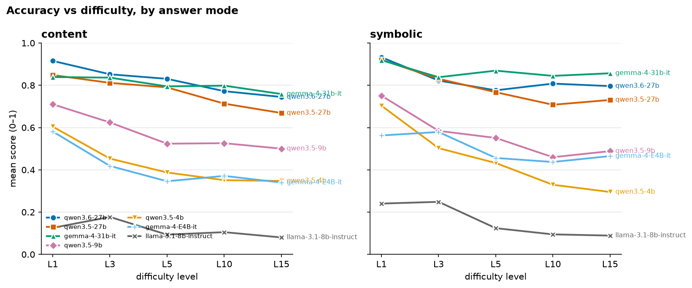
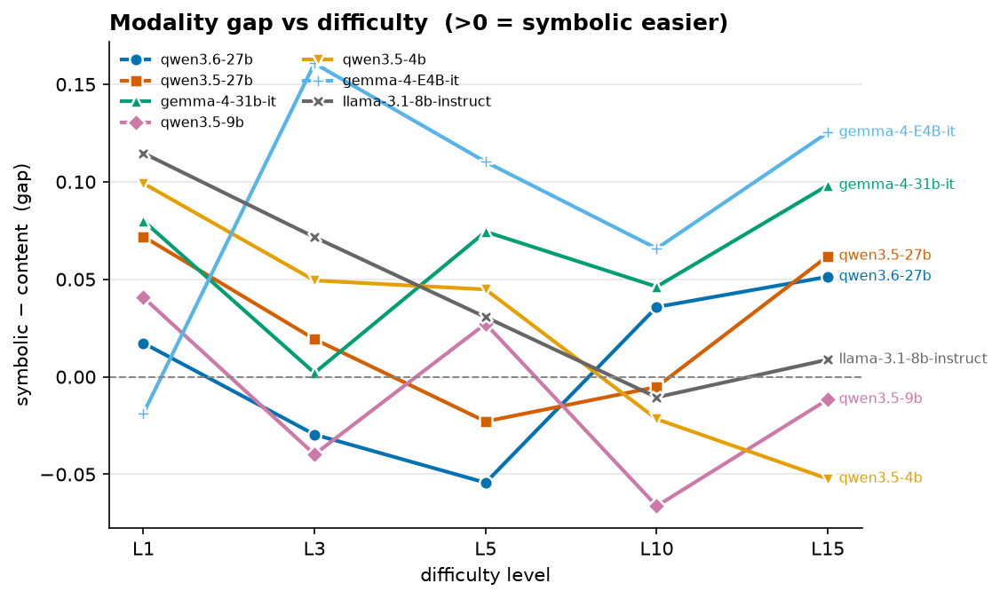
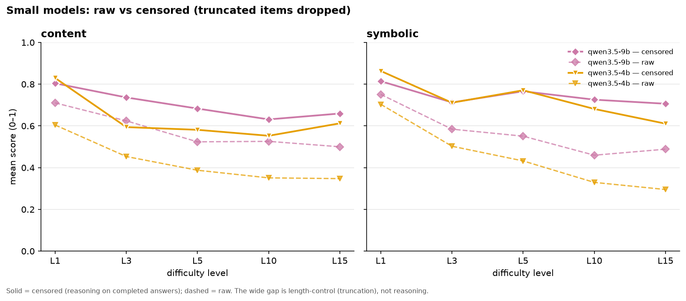
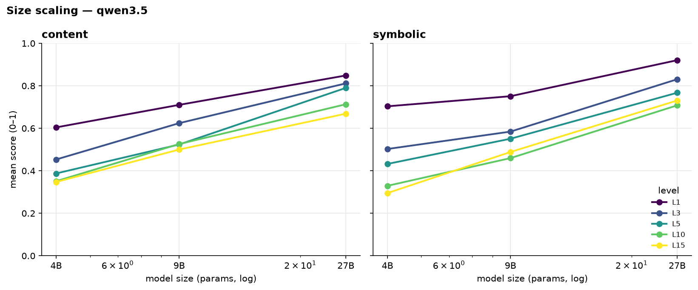
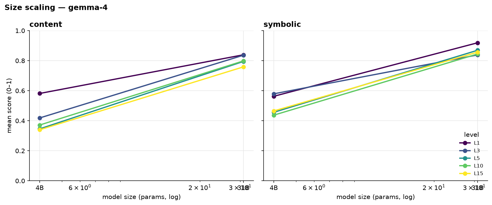
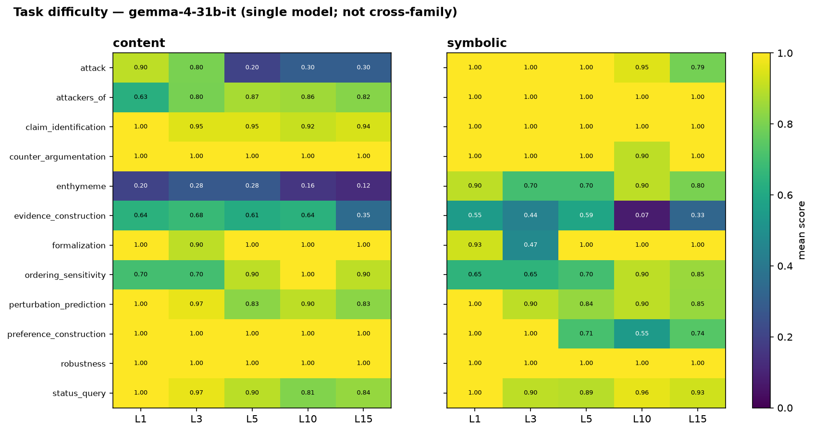

# ArgGYM frontier-model evaluation — 2026-07-27

Evaluation of instruction-tuned models on the ArgGYM defeasible-reasoning
benchmark across five difficulty levels, in both answer modes.

- **Taskset:** `pilot-20260725T195019Z-bb83218f` (1200 items; KB `0994f44e`)
- **Grid:** 12 tasks × 2 modes × 5 levels {1, 3, 5, 10, 15} × 10 samples,
  complete: 35 of 35 `(model, level)` cells, 8400 scored generations, zero API
  errors.
- **Models:** qwen3.6-27b, qwen3.5-27b, qwen3.5-9b, qwen3.5-4b, gemma-4-31b-it,
  gemma-4-E4B-it, llama-3.1-8b-instruct (served from the ungated
  `NousResearch/Meta-Llama-3.1-8B-Instruct` mirror of the identical weights)
- **Elicitation:** none (thinking on where supported); greedy decode per each
  model's own `generation_config`.
- Each `(model, level)` pair is a **standalone** 240-item run and score, so
  per-level performance is directly comparable.

Gold is computed symbolically by the ASPIC+ engine (PyArg) under grounded
semantics — **never by an LLM.** Every item passes a build-time self-check (its
own gold scores 1.0), so a low score is never the gold being wrong. It can still
be something other than a reasoning miss: an answer that never reaches the scorer
in a readable form scores 0 too, and for two models that is most of what the
score measures (§5).

> **Reporting principle — content and symbolic are never combined.** The two
> modes present the same tasks through different input representations
> (natural-language statements vs. DSL atoms); they are not commensurable, so
> their mean is not a quantity. The harness enforces this rather than relying on
> discipline: `evals/scoring.py` emits score fields only for groups that share
> one mode, so a cross-mode average cannot be computed downstream. Results are
> reported per mode, plus their *gap* (a signed difference, which — unlike an
> average — is meaningful).

Figures are regenerated by `make_figures.py` in this folder.

---

## 1. Findings

1. **The ranking flips with difficulty, in both modes.** qwen3.6-27b is the
   strongest model at L1 (content 0.915, symbolic 0.933). From L3 on
   **gemma-4-31b-it leads symbolic** (0.838 / 0.869 / 0.845 / 0.857), and from
   L10 it leads content too. The flip is driven by decay rate, not by peak
   ability: gemma starts third in content and ends first.
2. **gemma-4-31b-it's symbolic score does not decay.** 0.919 → 0.857 across a
   15× difficulty range (−0.062), essentially flat from L3, against −0.136 for
   qwen3.6-27b and −0.190 for qwen3.5-27b. Its content score decays normally
   (0.839 → 0.759), so the flatness is specific to the symbolic representation.
3. **That flatness is two tasks, not a general property.** Per task (§7),
   gemma's symbolic advantage at L15 is `enthymeme` (+0.68) and `attack` (+0.49);
   on `preference_construction` the sign reverses (−0.26). Read the aggregate gap
   as the sum of a few strong task-level effects, not as a uniform representation
   preference.
4. **Size scaling is monotone within each family** (Qwen 3.5: 4B < 9B < 27B;
   Gemma: E4B < 31B) at every level in both modes, with the gap widening at
   harder levels — but the size *step* is comparable across the two families,
   and both are confounded by the failure modes in §5 (§6).
5. **Most of the bottom half of the roster is not measuring reasoning.** Two
   distinct non-reasoning failures dominate: the small Qwens run into the token
   cap (truncation up to 52%), while gemma-4-E4B-it and llama-3.1-8b never
   truncate but fail to emit the answer contract on 21–37% of items. Censoring
   corrects the first and cannot touch the second. This is the report's most
   important caveat (§5).

---

## 2. How to read the levels

Levels are ordinal, not linear. **L1–L5 walk a feature ladder** (conflict/negation
unlock by L2, axioms/side-branches by L3, strict rules/chains by L4, undercuts by
L5); **L10 and L15 add only scale** (more atoms/rules, no new phenomena). So an
L1→L5 drop reflects *new kinds of reasoning*, while L5→L15 reflects *size* alone —
and scores largely plateau there for the strong models.

---

## 3. Accuracy vs difficulty, by mode

**Content** (mean score; bold = best at that level)
| model | L1 | L3 | L5 | L10 | L15 |
|---|---|---|---|---|---|
| qwen3.6-27b | **0.915** | **0.852** | **0.831** | 0.772 | 0.745 |
| gemma-4-31b-it | 0.839 | 0.836 | 0.795 | **0.798** | **0.759** |
| qwen3.5-27b | 0.849 | 0.811 | 0.790 | 0.713 | 0.669 |
| qwen3.5-9b | 0.710 | 0.624 | 0.524 | 0.526 | 0.500 |
| qwen3.5-4b | 0.604 | 0.453 | 0.388 | 0.351 | 0.347 |
| gemma-4-E4B-it | 0.582 | 0.418 | 0.346 | 0.371 | 0.340 |
| llama-3.1-8b-instruct | 0.126 | 0.177 | 0.093 | 0.105 | 0.080 |

**Symbolic** (mean score; bold = best at that level)
| model | L1 | L3 | L5 | L10 | L15 |
|---|---|---|---|---|---|
| qwen3.6-27b | **0.933** | 0.823 | 0.776 | 0.808 | 0.796 |
| gemma-4-31b-it | 0.919 | **0.838** | **0.869** | **0.845** | **0.857** |
| qwen3.5-27b | 0.920 | 0.831 | 0.767 | 0.708 | 0.731 |
| qwen3.5-9b | 0.751 | 0.584 | 0.551 | 0.460 | 0.488 |
| qwen3.5-4b | 0.704 | 0.503 | 0.432 | 0.329 | 0.295 |
| gemma-4-E4B-it | 0.563 | 0.579 | 0.456 | 0.437 | 0.465 |
| llama-3.1-8b-instruct | 0.240 | 0.249 | 0.124 | 0.095 | 0.089 |

**Reading:** The three ≥27B models are within 0.08 of each other at L1 in both
modes and separate as difficulty rises. In **content** they stay close throughout
(0.09 spread at L15) with qwen3.6 ahead early and gemma ahead late. In
**symbolic** they diverge sharply: gemma holds ~0.85 from L3 while qwen3.5-27b
falls to 0.731 and qwen3.6-27b to 0.796. Decay from L1 to L15, symbolic:
gemma −0.06, qwen3.6 −0.14, qwen3.5-27b −0.19, qwen3.5-9b −0.26, qwen3.5-4b −0.41.

---

## 4. Modality gap (symbolic − content)

How much the input representation matters, per model and difficulty. Positive =
symbolic easier. (The signed gap is meaningful; the average of the two modes is
not.)

| model | L1 | L3 | L5 | L10 | L15 |
|---|---|---|---|---|---|
| qwen3.6-27b | +0.017 | −0.030 | −0.054 | +0.036 | +0.051 |
| gemma-4-31b-it | +0.080 | +0.002 | +0.074 | +0.046 | +0.098 |
| qwen3.5-27b | +0.072 | +0.019 | −0.023 | −0.005 | +0.062 |
| qwen3.5-9b | +0.041 | −0.040 | +0.027 | −0.066 | −0.012 |
| qwen3.5-4b | +0.099 | +0.049 | +0.045 | −0.022 | −0.052 |
| gemma-4-E4B-it | −0.019 | +0.161 | +0.110 | +0.066 | +0.125 |
| llama-3.1-8b-instruct | +0.115 | +0.072 | +0.031 | −0.010 | +0.009 |

**Reading:** gemma-4-31b-it has the only consistently positive gap among the
large models — symbolic easier at every level, largest at L15 (+0.098) — but it
does not grow monotonically, and the L3 value is ~0. The 27B Qwens hover near
zero and change sign, so on this evidence they are mode-agnostic. **Most cells
here are within the ~0.04 standard error, so only gemma's L1/L5/L15 values and
gemma-4-E4B-it's L3/L5/L15 values are individually resolvable**; the rest should
be read as "no detectable gap" rather than as small effects. qwen3.5-4b's gap
turns negative at L10/L15, where its symbolic truncation (52%) exceeds its
content truncation (44%) — a length artifact, not content strength.

---

## 5. Two non-reasoning failure modes

An item can score 0 without the model being wrong about defeasible reasoning: its
generation can hit the token cap (**truncation**), or it can finish and never emit
the `[answer]` region the submission contract asks for (**no region**). Both
dominate the bottom of the roster, and they need different fixes. The censored
score drops truncated items, isolating reasoning on completed answers.

**Truncated / no-region rates** (both are mode-agnostic plumbing questions)
| model | L1 | L3 | L5 | L10 | L15 |
|---|---|---|---|---|---|
| qwen3.6-27b | 0% / 0% | 1% / 2% | 3% / 2% | 1% / 2% | 1% / 1% |
| gemma-4-31b-it | 0% / 3% | 0% / 0% | 0% / 0% | 0% / 0% | 0% / 0% |
| qwen3.5-27b | 0% / 1% | 2% / 4% | 0% / 5% | 4% / 8% | 5% / 9% |
| qwen3.5-9b | 11% / 3% | 18% / 11% | 26% / 24% | 27% / 21% | 28% / 27% |
| qwen3.5-4b | 27% / 9% | 29% / 21% | 39% / 35% | 45% / 40% | 48% / 42% |
| gemma-4-E4B-it | 0% / 24% | 0% / 21% | 0% / 22% | 0% / 25% | 0% / 21% |
| llama-3.1-8b-instruct | 2% / 36% | 2% / 31% | 1% / 34% | 3% / 37% | 1% / 35% |

**Length-limited: qwen3.5-9b and qwen3.5-4b.** Censoring changes the picture
completely, and by more in symbolic than content — so the correction itself is
mode-dependent and must be applied per mode:

| raw → censored | L1 | L3 | L5 | L10 | L15 |
|---|---|---|---|---|---|
| qwen3.5-9b content | 0.710 → **0.804** | 0.624 → **0.736** | 0.524 → **0.683** | 0.526 → **0.631** | 0.500 → **0.659** |
| qwen3.5-9b symbolic | 0.751 → **0.814** | 0.584 → **0.713** | 0.551 → **0.766** | 0.460 → **0.726** | 0.488 → **0.706** |
| qwen3.5-4b content | 0.604 → **0.829** | 0.453 → **0.594** | 0.388 → **0.581** | 0.351 → **0.553** | 0.347 → **0.612** |
| qwen3.5-4b symbolic | 0.704 → **0.863** | 0.503 → **0.711** | 0.432 → **0.771** | 0.329 → **0.681** | 0.295 → **0.611** |

Censored, the 9B holds 0.63–0.81 and the 4B 0.55–0.86 — far flatter and higher
than raw, because up to half their items loop into the cap rather than reason
worse. **qwen3.5-4b censored symbolic (0.611 at L15) is within 0.12 of
qwen3.5-27b raw (0.731)**, so the raw four-fold size gap is mostly length
control. Any capability read on these two must quote censored alongside raw.

**Format-limited: gemma-4-E4B-it and llama-3.1-8b.** Neither truncates, so
censoring moves them by ≤0.006 and no correction is available; instead a fifth to
well over a third of their items never emit the required region. That is an
instruction-following failure against the default `answer_tags` template and
cannot be separated from reasoning within this run. Read both as floors set by
format compliance. A less strict template, or a `cot`/`concise` elicitation,
would likely recover some of it — the roster deliberately holds the template
fixed for comparability, and that choice costs these two models the most.

---

## 6. Size scaling

Score vs. model size at fixed generation, per level, per mode. Reading upward
along a curve shows the size effect; the vertical spread between level-curves
shows how much each size loses to difficulty. (Small-model points are raw; §5
gives the corrections.)

**Reading:** Size ordering is monotone at every level in both modes (Qwen 3.5:
4B < 9B < 27B; Gemma: E4B < 31B), and the level-curves fan out with size —
**larger models lose less to difficulty.** The two families' size steps are
comparable, not distinguishable: gemma-4-31b-it beats gemma-4-E4B-it by
0.26–0.45 across cells, and qwen3.5-27b beats qwen3.5-4b by 0.22–0.44 over a
similar span. Neither ladder supports a claim that one family scales better.

Both ladders are also weaker evidence than they look. E4B is a nested/distilled
variant rather than a clean smaller pretrain, and it never truncates, so no
censoring can correct the ~23% of its items that emit no answer region (§5) —
an unknown part of the Gemma step is format compliance, not reasoning. The Qwen
step is inflated in the other direction: censored, qwen3.5-4b reaches 0.611
symbolic at L15 against qwen3.5-27b's 0.731 raw, so most of the raw 0.44 gap at
that cell is length control. **Neither ladder should be quoted as a scaling
result** until the small models are re-run under a template they can satisfy and
with a cap they do not hit.

---

## 7. Task-difficulty profile (single reference model)

Per-task × level for one model — apples-to-apples, no cross-family averaging.
gemma-4-31b-it is the reference: it is the strongest model at the hard levels.

**Reading:** The aggregate scores hide a very uneven profile.
`counter_argumentation`, `robustness`, `formalization` and `claim_identification`
sit at or near ceiling in both modes at every level, contributing almost no
discrimination at this capability level. The score is spent on a handful of
tasks, and they behave very differently across modes:

| task (gemma-4-31b-it, L15) | content | symbolic | gap |
|---|---|---|---|
| enthymeme | 0.12 | 0.80 | **+0.68** |
| attack | 0.30 | 0.79 | **+0.49** |
| attackers_of | 0.82 | 1.00 | +0.18 |
| evidence_construction | 0.35 | 0.33 | −0.02 |
| preference_construction | 1.00 | 0.74 | **−0.26** |

**gemma's modality gap is `enthymeme` and `attack`, and it is partly cancelled by
`preference_construction` pulling the other way.** Both of the positive tasks
require *constructing* an argument that the engine then verifies, and both
collapse in content while staying near ceiling in symbolic — the model can do the
inference but not over natural-language statements. `evidence_construction` is
the hardest task in both modes (0.35 / 0.33 at L15, and 0.07 symbolic at L10) and
is the only one where content and symbolic are equally hard.

---

## 8. Caveats and threats to validity

- **The content-vs-symbolic gap is confounded.** Content and symbolic items are
  *independent instances*, not two renderings of one problem (different seeds;
  symbolic uses abstract atoms, content is drawn from real KB arguments). So the
  gap mixes representation, different logical instances, and world-knowledge
  priors. Read it as a descriptive model property here, not a clean
  representation measurement. A follow-up benchmark pairing one fixed structure
  with several coherent content renderings exists to de-confound it
  (`paired-v2` taskset, repo issue #15).
- **Small-model comparisons require censored scores** (§5) — but only for the
  truncation-limited small Qwens. gemma-4-E4B-it and llama-3.1-8b are
  format-limited, where censoring does nothing and no correction is available.
- **Two models' scores are format-compliance floors, not reasoning reads**
  (gemma-4-E4B-it, llama-3.1-8b; §5). llama is also the only external-family
  model, served from an ungated mirror of the identical weights, not
  cryptographically verified against Meta's repo.
- **Pure-scale levels carry little extra signal** — the informative difficulty is
  the qualitative feature ladder (L1–L5).
- **Point estimates:** single decode per item, 10 samples per (task, mode, level)
  cell. Standard error per (model, level, mode) cell is 0.016–0.044 (median
  0.036), so **differences below ~0.07 between two cells are not resolvable**.
  Per-task numbers in §7 rest on 10 items each and are indicative only.

---

## 9. Reproducibility

- The taskset regenerates. `python -m evals.verify_taskset
  data/tasksets/pilot-20260725T195019Z-bb83218f` rebuilds all 1200 prompts
  byte-for-byte from the recorded `git_sha` (`cd5510f`, clean tree), so the
  questions this report asks are identifiable from source. Generation is a pure
  function of its seed and is invariant under `PYTHONHASHSEED`, which is verified
  by `tests/test_generation_determinism.py`.
- Scores recompute offline from stored generations via the ASPIC+ engine — no
  GPU. Every number here comes from replaying `evals/scoring.py` over the stored
  generations; re-running that replay reproduces the report.
- Per-run provenance (model, sampling, elicitation, hashes, git SHA) is in each
  run's `run.json`. Sweep id `grid-2026-07-25`.
- Figures: `make_figures.py` in this folder.
